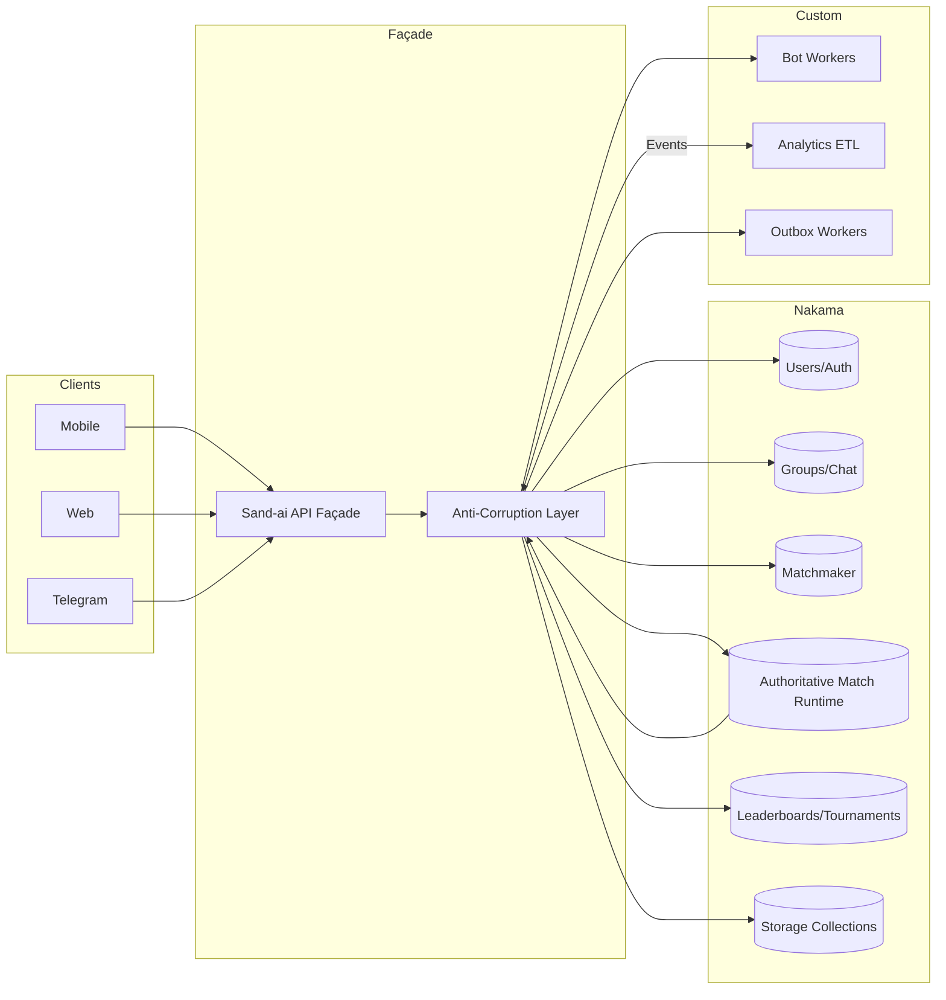
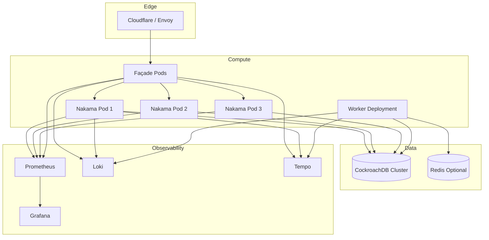

# Sand-ai Architecture & Scale Plan

## Executive Summary
- Sand-ai now runs on Heroic Labs' Nakama cluster, delegating core social, realtime, and persistence primitives to a hardened platform while keeping Sand-ai domain rules encapsulated.
- DDD boundaries remain intact: bounded contexts interact with Nakama through anti-corruption adapters, ensuring aggregates stay free of vendor SDK types.
- Production posture improves via CockroachDB-backed storage, Nakama console/metrics, and standardized observability, reducing operational toil and accelerating scale-out.

## Context & Principles
- **Domain quarantine**: Aggregates live in service modules that depend on ports/protocols; adapters translate to Nakama gRPC/HTTP/WebSocket APIs.
- **Anti-corruption layers**: Each bounded context exposes repositories that wrap Nakama clients, translating Sand-ai value objects to Nakama structs and back.
- **Idempotent writes**: Commands carry dedupe keys persisted in Nakama storage or CockroachDB tables to guarantee exactly-once semantics across retries.
- **Event-first integration**: Outbox pattern is mandatory; domain events publish to a `sandai.events` collection, consumed by workers through CDC or queue bridges.
- **Security & compliance**: Sessions terminate in Nakama; façade services issue JWTs signed with rotating keys, and PII never leaves CockroachDB without masking.

## Bounded Contexts
| Context | Core Responsibility | Owner | Primary Persistence | Notes |
| --- | --- | --- | --- | --- |
| Player Experience | Accounts, auth flows, session lifecycle, entitlements | **Nakama** (Users/Auth) + Custom façade | Nakama users, CockroachDB | Façade decorates Nakama auth to enforce Sand-ai device policy.
| Social Graph | Groups, parties, chat rooms, invites | **Nakama** | Nakama groups, chat channels | Custom policies enforced via hooks.
| Competitive Play | Matchmaking, authoritative matches, scoring | Shared (Nakama Matchmaker + Custom match service) | Nakama realtime runtime, CockroachDB snapshots | Authoritative loops implemented as Nakama runtime module.
| Progression & Leaderboards | Seasonal ranks, tournaments, rewards | **Nakama** (Leaderboards/Tournaments) with custom rollup worker | Nakama leaderboard/tournament records, CockroachDB history | Snapshot job writes seasonal archives.
| Economy & Purchases | Virtual goods, purchase validation, inventory | **Nakama** (Purchase Validation, Storage) + external billing | CockroachDB (inventory), External PSP | PSP webhook uses façade; acknowledgements persisted via outbox.
| Automation & Bots | Telegram bot, notifications, analytics gateways | **Custom Platform** | CockroachDB (commands/outbox), BigQuery | Consumes Nakama events via webhook/stream adapters.
| Observability & Operations | Metrics, alerts, admin console | **Shared** | Prometheus, Loki, Tempo | Nakama console at `:7351`; custom exporters feed Grafana.

## Aggregates & Repositories
- **PlayerAccount** *(CockroachDB via Nakama Users)*: repository wraps Nakama `/v2/account/authenticate/*` APIs; stores device fingerprints in `storage.collection("player_meta")` with key = `player:<userId>`.
- **Session** *(Nakama sessions)*: façade validates Nakama JWT, persists session metadata (IP, device) in CockroachDB.
- **Group** *(Nakama groups)*: repository maps Sand-ai `GroupId` to Nakama group ID; additional metadata stored in Storage objects (`collection: group_meta`).
- **Party** *(Nakama parties)*: stored natively; aggregate enforces composition rules through runtime hook `BeforePartyJoin`.
- **BattleMatch** *(Nakama authoritative match + CockroachDB snapshots)*: match state stored via Nakama match state; snapshots saved to CockroachDB `battle_snapshot` table through runtime module.
- **LeaderboardSeason** *(Nakama leaderboards + CockroachDB archival)*: repository posts scores through Nakama RPC; nightly worker dumps to history table.
- **BotCommand** *(CockroachDB + Outbox)*: commands ingested via façade, stored in `bot_commands` table with dedupe key, published to queue worker.
- **NotificationOutbox** *(CockroachDB)*: writes pending notifications consumed by worker that calls Nakama in-app notification or external channel.

## Integration Patterns
- **Outbox/Inbox**: All domain events appended to `sandai_outbox` (CockroachDB) with status. Worker transcodes to Kafka or Nakama notifications; inbox ensures idempotent processing for external callbacks.
- **Event Types**: `PlayerAuthenticated`, `MatchStarted`, `MatchCompleted`, `LeaderboardUpdated`, `PurchaseValidated`, `BotCommandQueued`.
- **Snapshotting**: Battle matches serialize state every N ticks to CockroachDB; failover nodes load last snapshot on match resume.
- **Idempotency**: Score submissions and purchases require `Idempotency-Key` header; façade stores key with TTL in `storage.collection("idempotency")`.
- **Retries**: Exponential backoff with jitter for Nakama RPC failures; circuit breaker trips after 5 consecutive errors per service.

## API Surface
Sand-ai exposes a `/v1` façade to clients; handlers call Nakama via gRPC/HTTP using adapters.

| Endpoint | Method | Description | Nakama Mapping |
| --- | --- | --- | --- |
| `/v1/auth/device` | `POST` | Authenticate device, return Sand-ai session JWT plus Nakama token | `POST /v2/account/authenticate/device` via gRPC, custom JWT wrapper |
| `/v1/auth/refresh` | `POST` | Exchange refresh token, rotate Nakama session | `POST /v2/session/refresh` |
| `/v1/profile` | `GET` | Fetch player profile with progression snapshot | `GET /v2/account` + Storage objects |
| `/v1/groups` | `POST` | Create group with Sand-ai metadata | `POST /v2/group` + storage write |
| `/v1/groups/{id}` | `PATCH` | Update roles/description | `PUT /v2/group/{id}` |
| `/v1/matchmaking/enqueue` | `POST` | Submit matchmaking ticket | Nakama Matchmaker `AddMatchmakerParty` |
| `/v1/matches/{matchId}/command` | `POST` | Submit battle command (idempotent) | Nakama RPC to authoritative match handler |
| `/v1/leaderboards/{season}/score` | `POST` | Submit score with dedupe key | `POST /v2/leaderboard/record` |
| `/v1/bot/webhook` | `POST` | Telegram webhook ingest, enqueue job | CockroachDB `bot_commands` + Nakama notification |
| `/v1/notifications` | `POST` | Send in-app notification from ops | Nakama `WriteNotification` RPC |

Error envelope:
```json
{
  "error": {
    "code": "MATCH_NOT_FOUND",
    "message": "Match unavailable",
    "idempotency_key": "abc-123"
  }
}
```

## Security
- **Auth flows**: Device/email/social logins routed through façade; Nakama tokens stored client-side, Sand-ai JWT contains minimal claims (playerId, roles, expiry) signed with rotating HS256 keys in Vault.
- **Session model**: Nakama session TTL = 2h; façade refresh token TTL = 24h; refresh rotates both tokens.
- **Webhook secrets**: Telegram secret stored in Vault; façade validates header before persisting command.
- **Rate limiting**: Envoy ingress enforces `200 req/min` per IP; Nakama runtime `BeforeAuthenticateDevice` denies suspicious bursts.
- **Multi-tenancy**: Tenant ID field carried in JWT and stored in Nakama metadata; storage keys prefixed with `tenant:<id>:`.
- **PII**: Email, device IDs stored only in CockroachDB encrypted at rest; logs hash these identifiers.

## Observability
- **Metrics**: Scrape Nakama Prometheus endpoint (`/metrics`), capturing `nakama_http_requests_total`, `nakama_session_count`, `nakama_match_count`, plus façade latency histograms.
- **Tracing**: OpenTelemetry SDK wraps façade and runtime modules; propagate `traceparent` header to Nakama via metadata.
- **Logging**: Structured JSON logs with requestId, playerId hash, tenant; shipped to Loki.
- **Dashboards**: Grafana boards for matchmaking queue depth, leaderboard write rate, CockroachDB latency, webhook failures.
- **SLOs**: Auth P99 < 300ms, Match start P95 < 2s, Leaderboard write success 99.9%, Webhook ingest success 99%.

## Capacity & Scaling
- **Nakama Nodes**: 3 pods (2 vCPU, 4GB RAM) behind Kubernetes service; HPA triggers on CPU > 65% and `nakama_session_count`.
- **CockroachDB**: 3-node cluster (4 vCPU, 16GB) with locality by AZ; use `--cache 25% --max-sql-memory 25%`.
- **Redis (Optional)**: Single Redis for ephemeral bot worker coordination; not used for gameplay state.
- **Match Shards**: Authoritative matches pinned per Nakama node via runtime; consistent hashing on `matchId` ensures locality.
- **Queue/Workers**: Go workers consume outbox, run in separate deployment with autoscale on queue depth.

## Runbooks
- **DB Lag**: Alert when `storage_engine_txn_restart` spikes; run `cockroach node status --ranges`; throttle write-heavy jobs, failover to read replica.
- **Matchmaker Backlog**: If queue depth > configured threshold, scale Nakama pods + match handlers; verify runtime logs for reject reasons.
- **WebSocket Churn**: Inspect `nakama_socket_connections`; if surge, check client version rollout; consider enabling connection rate limits.
- **429/5xx from Façade**: Check Envoy rate limit logs; verify Nakama node health; rotate dedupe cache if saturated.

## Migration Plan
1. **Inventory Data**: Export MySQL users, groups, battle metadata; map schemas to Nakama user/account fields and storage collections.
2. **Dual Writes**: Update legacy API to write to both MySQL/Redis and Nakama storage for 2 weeks using change-data-capture.
3. **Backfill**: Use Nakama batch import scripts to load leaderboards and group membership; convert Redis sessions to Nakama tokens via device re-auth.
4. **Cutover**: Switch API façade to Nakama endpoints; enable read-only mode on legacy DB; monitor SLOs for 24h.
5. **Decommission**: Retire Redis session store; archive MySQL; keep read replica for 30-day rollback window.

## Risks & Mitigations
- **Feature Gaps**: Missing specific economy features in Nakama; mitigate with runtime code or external service bridging.
- **Vendor Lock-in**: Abstract adapters and maintain contract tests; ensures swap capability.
- **Performance Hotspots**: Leaderboard burst writes; throttle via queue, pre-aggregate scores.
- **Schema Growth**: Monitor CockroachDB table size; partition historical snapshots by season.
- **Operational Complexity**: Staff training on Nakama console and runtime; schedule enablement sessions.

## Mermaid – Context Map


## Mermaid – System Architecture


## Ownership Matrix
| Capability | Bounded Context | Owner | Persistence | Interfaces | Notes |
| --- | --- | --- | --- | --- | --- |
| Auth & Users | Player Experience | Nakama | Nakama users (CockroachDB) | gRPC `/v2/account/authenticate/*`, REST | Façade wraps for device policy.
| Sessions | Player Experience | Nakama | Nakama session store | JWT, WebSocket | Façade issues secondary JWT.
| Groups | Social Graph | Nakama | Group records (CockroachDB) | REST `/v2/group` | Hooks enforce Sand-ai roles.
| Leaderboards | Progression | Nakama | Leaderboard tables | REST `/v2/leaderboard/record` | Archival worker writes history.
| Tournaments | Progression | Nakama | Tournament tables | REST `/v2/tournament/*` | Seasonal config via console API.
| Parties | Social Graph | Nakama | Party runtime | WebSocket | Hooks limit party size per tier.
| Chat | Social Graph | Nakama | Channel data | WebSocket, gRPC | Moderation via runtime script.
| Realtime Match | Competitive Play | Shared | Nakama runtime state + CockroachDB snapshots | WebSocket, RPC | Authoritative loop in module.
| Purchase Validation | Economy | Nakama + Custom PSP | CockroachDB inventory | REST `/v2/purchase/validate` + PSP webhook | Outbox sync to PSP.
| Storage Objects | Shared | Nakama | Storage collections | gRPC Storage APIs | Prefix with tenant.
| Bot Commands | Automation | Custom | CockroachDB `bot_commands` | REST `/v1/bot/webhook` | Worker reads queue.
| Outbox | Automation | Custom | CockroachDB `sandai_outbox` | gRPC notifications, Kafka | Ensures once delivery.
| Analytics Events | Automation | Custom | BigQuery / Warehouse | Pub/Sub connector | Derived from outbox.
| Notifications | Automation | Shared | CockroachDB + Nakama notification store | `WriteNotification`, email API | Worker fans out.

## API Façade Contract
```
POST /v1/auth/device
  Request: { "device_id": "string", "uid": "optional" }
  Response: { "player_id": "uuid", "nakama_token": "jwt", "session_token": "jwt" }
  Idempotency-Key header required.

POST /v1/auth/refresh
  Request: { "refresh_token": "jwt" }
  Response: { "nakama_token": "jwt", "session_token": "jwt" }

GET /v1/profile
  Headers: Authorization: Bearer <session_token>
  Response: { "player": { ... }, "progression": {...} }

POST /v1/groups
  Body: { "name": "string", "description": "string", "visibility": "public|private" }
  Response: { "group_id": "uuid" }

PATCH /v1/groups/{id}
  Body: { "description": "string", "metadata": {"tier": "gold"} }

POST /v1/matchmaking/enqueue
  Body: { "skill": 1200, "modes": ["duo"], "party_id": "uuid" }
  Response: { "ticket": "uuid" }

DELETE /v1/matchmaking/{ticket}
  Response: 204

POST /v1/matches/{matchId}/command
  Body: { "command": "attack", "payload": {...}, "idempotency_key": "uuid" }
  Response: { "accepted": true }

POST /v1/leaderboards/{season}/score
  Body: { "score": 12345, "metadata": {"source": "pve"}, "idempotency_key": "uuid" }
  Response: { "rank": 10 }

POST /v1/bot/webhook
  Telegram payload; requires `X-Telegram-Bot-Api-Secret-Token`
  Response: 202

POST /v1/notifications
  Body: { "player_ids": ["uuid"], "title": "string", "content": "string", "ttl": 3600 }
  Response: 202
```

Error schema applies across endpoints.

## Local Dev Compose
```yaml
version: "3.9"
services:
  cockroach:
    image: cockroachdb/cockroach:v23.1.11
    command: start-single-node --insecure --http-addr :8081 --sql-addr :26257
    ports: ["26257:26257", "8081:8081"]
    volumes:
      - crdb-data:/cockroach/cockroach-data
  nakama:
    image: heroiclabs/nakama:3.21.0
    depends_on: [cockroach]
    entrypoint: ["/bin/sh","-ec","/nakama/nakama --database.address cockroach:26257 --runtime.path /data/modules --console.port 7351"]
    ports: ["7350:7350", "7351:7351", "7349:7349", "9100:9100"]
    volumes:
      - ./modules:/data/modules
  facade:
    build: ./cmd/facade
    environment:
      NAKAMA_GRPC_ADDR: nakama:7349
      COCKROACH_DSN: postgres://root@cockroach:26257/defaultdb?sslmode=disable
    ports: ["8080:8080"]
  prometheus:
    image: prom/prometheus:latest
    volumes:
      - ./ops/prometheus.yml:/etc/prometheus/prometheus.yml
    ports: ["9090:9090"]
volumes:
  crdb-data:
```

## Runtime Module Skeletons
```ts
// modules/hooks.ts
import { Context, Logger, Nakama, Session } from "@heroiclabs/nakama-runtime";

export const beforeAuthenticateDevice: Nakama.BeforeAuthenticateDeviceFunction = (ctx: Context, logger: Logger, payload) => {
  if (!payload.device_id) {
    throw Error("DEVICE_ID_REQUIRED");
  }
  return payload;
};

export const afterAuthenticateDevice: Nakama.AfterAuthenticateDeviceFunction = (ctx: Context, logger: Logger, session: Session, payload) => {
  logger.info("authenticated device %s", session.user_id);
  // enqueue domain event via RPC call to façade if needed
  return payload;
};
```

```ts
// modules/leaderboard.ts
import { Context, Logger, Nakama } from "@heroiclabs/nakama-runtime";

export const submitScoreRpc: Nakama.RpcFunction = (ctx: Context, logger: Logger, nk: Nakama, payloadStr: string) => {
  const payload = JSON.parse(payloadStr);
  if (!payload.idempotency_key) throw Error("IDEMPOTENCY_KEY_REQUIRED");
  const existing = nk.storageRead([{ collection: "idempotency", key: payload.idempotency_key, userId: ctx.userId }]);
  if (existing.length) {
    return JSON.stringify(existing[0].value);
  }
  const result = nk.leaderboardRecordWrite(payload.leaderboardId, ctx.userId, ctx.username, payload.score, payload.subscore || 0, payload.metadata || {});
  nk.storageWrite([{ collection: "idempotency", key: payload.idempotency_key, userId: ctx.userId, value: result }]);
  return JSON.stringify(result);
};
```

```ts
// modules/match.ts
import { Context, Logger, Nakama, MatchLoop, MatchState } from "@heroiclabs/nakama-runtime";

type BattleState = MatchState & {
  tick: number;
  players: Record<string, any>;
};

export const matchInit: Nakama.MatchInitFunction = (ctx, logger, params): [BattleState, number, string] => {
  const state: BattleState = { tick: 0, players: {} };
  return [state, 1000, "SandAiBattle"];
};

export const matchLoop: MatchLoop = (ctx, logger, nk, dispatcher, tick, state: BattleState) => {
  state.tick++;
  // apply commands, update state, optionally snapshot via nk.storageWrite
  return { state, tickRate: 30, label: "" };
};

export const matchTerminate: Nakama.MatchTerminateFunction = (ctx, logger, nk, dispatcher, state: BattleState, graceSeconds: number) => {
  // flush final snapshot to CockroachDB via RPC
};
```

## Checklists

### Go-Live
- [ ] Vault populated with Nakama console credentials, façade JWT secrets, Telegram secret.
- [ ] CockroachDB backups scheduled (`cockroach backup` nightly).
- [ ] HPA configured for Nakama and façade deployments.
- [ ] Leaderboard/tournament configs loaded via Nakama console.
- [ ] Alert rules applied (auth latency, match queue depth, DB lag).

### Chaos / Load Test
- [ ] Simulate 10k WebSocket connections with churn; monitor `nakama_socket_connections`.
- [ ] Stress matchmaking with varied skill buckets; confirm queue drain < 2s.
- [ ] Burst leaderboard writes (1k ops/sec) with idempotency keys.
- [ ] Replay bot webhook flood (5x normal); ensure outbox workers keep pace.

### Observability
- [ ] Grafana dashboards validated for auth, match, leaderboard, webhook.
- [ ] Alertmanager routes configured for PagerDuty/Slack.
- [ ] Loki queries for top error codes, Telegram webhook failures.
- [ ] Tempo traces sampled at 10% for façade; adjust if SLO breaches.
- [ ] CockroachDB `debug zip` script documented for incidents.
